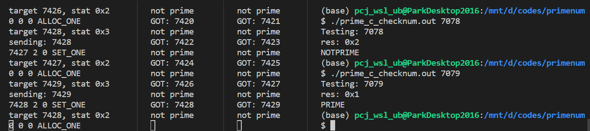

# IPC를 이용한 소수 계산 프로그램

## 주제
계산이 오래걸리는 소수 계산을 여러 프로세스로 분산시켜 IPC로 통신토록 함.

## 설계도

프로세스는 크게 서버 프로세스와 클라이언트 프로세스로 나뉘어진다.
공통되는 코드는 [`prime_common.h`](./prime_common.h)에 있다.

### 서버 프로세스

코드: [`prime_server.c`](./prime_server.c)

서버는 계산된 수들이 저장된 파일들을 관리하며, 클라이언트의 요청에 따라:

1. 계산할 수 할당 `alloc_one()`: `primenum_t`
2. 계산된 수 저장 `set_one(primenum_t, enum Numstat)`: `void`
3. 요청된 수에 대한 정보 전달 `check_num(primenum_t)`: `bool`

을 한다.

#### 파일 관리

헤더는 [`prime_files.h`](./prime_files.h)에 있다. 서버 클라이언트는 이 세부사항을 몰라도 된다.

코드: [`prime_files.c`](./prime_files.c)

이진수의 비트중 가장 significant한 '1'의 위치를 `working_bit`(`wb`) 로 정의하여, 고정된 `wb`에서 만들어 질수 있는 수들을 `<wb>.primes`에 저장한다.
예를 들어, `2.primes`은 `0b0100`, `0b0101`, `0b0110`, `0b0111`에 대한 정보를 저장한다.
각 수는 2비트를 이용하여 (즉, 1바이트에 네 수를 저장하여) 기록되는데, (아직 계산되지 않음), (소수), (소수 아님), (할당됨) 4가지 상태가 저장된다.
(이 상태(`enum Numstat`)는 위의 `prime_common.h`에 정의되어 있다.)

### 클라이언트 프로세스

#### 수 할당 및 계산 (1, 2)

코드: [`prime_c_loop.c`](./prime_c_loop.c)

이 클라이언트는 무한루프를 돌며

1. 서버에게 IPC를 통해 요청해 수를 할당받고,
2. 그 수를 계산한 다음,
3. 다시 서버에게 통보한다.

#### 수에 대한 정보 확인 (3)

코드: [`prime_c_checknum.c`](./prime_c_checknum.c)

이 클라이언트는 서버에게 IPC를 통해 수를 전달하여 그 수에 대한 정보 (위에 있는 대로 소수/소수아님 여부 등)을 반환받아 출력한다.

## 사용된 기술

### IPC

이 프로젝트는 메세지 큐를 이용해 구현되었다.

#### 메세지 구조

메세지는 `prime_common.h`에 정의되어있는 대로
- `mtype`: 메세지 종류. (Response의 경우) 함수에 따라 구별하여 원하는 종류의 메세지만 받을 수 있도록 하였음.
- `cmd`: 호출하고자 하는 함수
- `args[]`: 인자들 (Response의 경우 반환값)

로 구성되어 있다. 프로그램의 특성상 PID를 구별할 필요는 없다.

예를 들어 `prime_c_checknum`은 `{ MTYP_REQ, CMD_CHECK_NUM, { 123 } }`의 메세지를 전달하고,
이에 서버는 `{ MTYP_RES_CHECK_NUM, CMD_CHECK_NUM, { NOTPRIME } }`을 반환한다.

### 시그널 처리

무한루프를 도는 서버와 `prime_c_loop`는 인터럽트 요청이 들어왔을때 종료 루틴 (서버는 파일 닫기, 클라이언트는 할당받은 수 비할당)을 실행할 수 있도록 시그널 핸들러를 작성하였다.

### 파일 조작

파일 조작을 위한 `prime_files.c`는 저수준 UNIX 파일 관리 함수들 (`read()`, `write()`, `lseek()`, `access()`, `open()`, `close()`, ...)을 사용하였다.

## 사용 매뉴얼

### 컴파일
```
make
```

### 서버 실행
```
./prime_server.out
```

### 할당 및 계산
```
./prime_c_loop.out
```
또는
```
./prime_c_loop.out 32
```
로 32개의 수만 계산

### 수 정보 얻기
예: 17
```
./prime_c_checknum 17
```

- `PRIME` / `NOTPRIME`
- `EMPTY`: 아직 계산되지 않음
- `ALLOC`: 아직 계산되지 않았거나 계산중임.

## 사용 예 캡처


왼쪽에서 오른쪽으로:
- 서버 프로세스
- 계산중인 클라이언트 1
- 계산중인 클라이언트 2
- 수를 검색중인 클라이언트. `7078`은 소수가 아니고 `7079`는 소수임을 알 수 있다.
